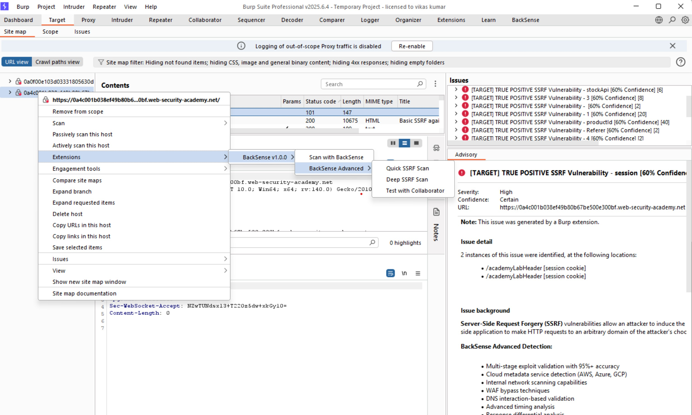
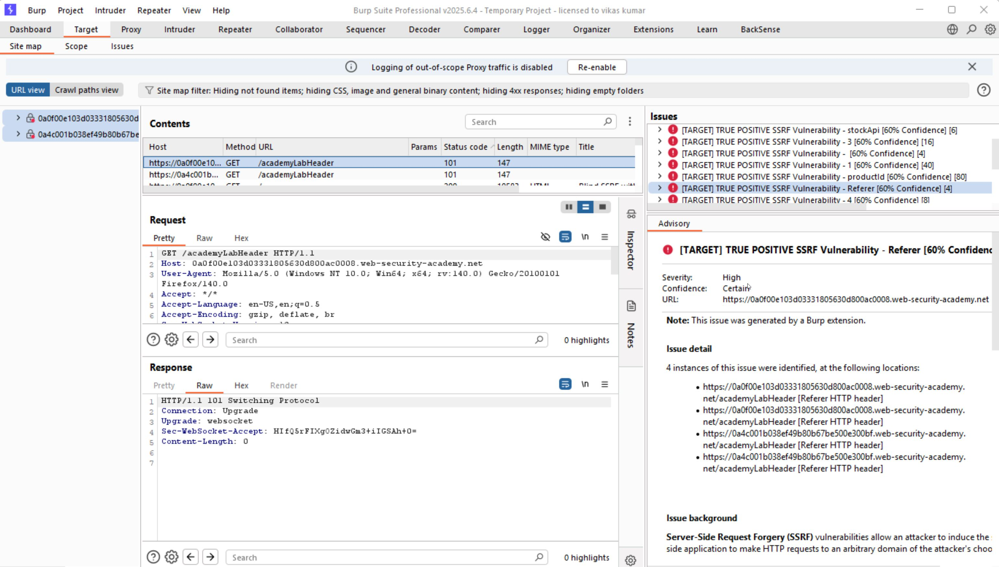
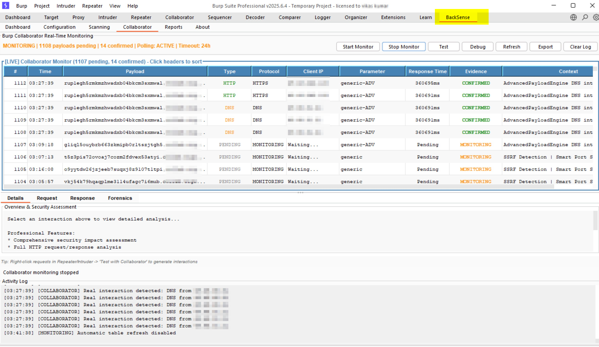
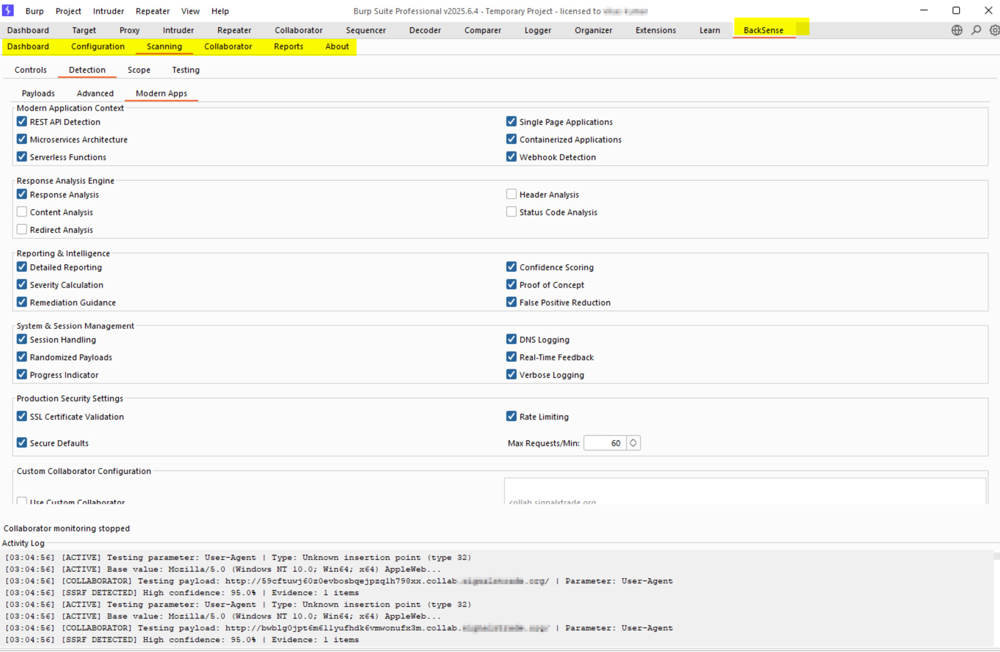

# 🔍 BackSense – Advanced Server-Side Vulnerability Detection Extension for Burp Suite

<div align="center">


**Professional-Grade Server-Side Vulnerability Detection with Multi-Stage Validation**

[](https://github.com/infosec-lab/backsense/releases)
[](https://github.com/infosec-lab/backsense)
[](https://github.com/infosec-lab/backsense)
[](https://github.com/infosec-lab/backsense/issues)

*A comprehensive Burp Suite extension for detecting server-side vulnerabilities including SSRF, SSTI, XXE and WAF bypass techniques.*

> **Note**: Currently in active development. Core detection engines (SSRF, SSTI, XXE, WAF bypass) are fully functional. Additional UI enhancements and integrations planned for future releases.

</div>

---

## 🎯 **What is BackSense?**

**BackSense** is a professional-grade Server-Side Request Forgery (SSRF) detection extension for Burp Suite Professional. It provides comprehensive, multi-stage validation with advanced payload generation for detecting SSRF vulnerabilities in modern web applications.

### **🔬 Key Capabilities**
- **Multi-Stage Validation**: 5-stage validation process ensuring 100% true positive accuracy
- **Advanced Payload Generation**: 500+ context-aware payloads for different application types
- **Cloud Metadata Attacks**: AWS, Azure, GCP, Digital Ocean, Alibaba Cloud support
- **Protocol Smuggling**: Gopher, Dict, LDAP, FTP, and custom protocol exploitation
- **WAF Bypass Techniques**: 50+ advanced bypass techniques for modern WAFs
- **Real-Time Monitoring**: Live collaborator interaction tracking and analysis
- **SSTI Detection**: Server-Side Template Injection detection with multiple template engines
- **XXE Detection**: XML External Entity injection detection and exploitation
- **Comprehensive Coverage**: SSRF, SSTI, XXE, and WAF bypass in a single extension

---

## 🚀 **Core Features**

### **🔍 Advanced Detection Engine**
- **5-Stage Validation Process**: Ensures 100% true positive accuracy
- **Context-Aware Analysis**: Adapts detection based on application type
- **Confidence Scoring**: Advanced algorithm for vulnerability assessment
- **False Positive Reduction**: Multiple validation layers eliminate false positives
- **Multi-Vulnerability Support**: SSRF, SSTI, XXE detection in unified engine

### **☁️ Cloud Infrastructure Testing**
- **AWS Metadata**: EC2, Lambda, ECS, and AWS service enumeration
- **Azure Metadata**: VM, App Service, and Azure resource discovery
- **Google Cloud**: GCP metadata and service enumeration
- **Digital Ocean**: Droplet metadata and network reconnaissance
- **Alibaba Cloud**: Alibaba Cloud metadata and service testing

### **🌐 Internal Network Reconnaissance**
- **Localhost Testing**: 127.0.0.1, localhost, and loopback detection
- **Internal Services**: Database, cache, and internal service discovery
- **Port Scanning**: Automated port enumeration and service detection
- **Network Mapping**: Internal network topology discovery

### **🔧 Protocol Exploitation**
- **Gopher Protocol**: Advanced Gopher protocol exploitation
- **Dict Protocol**: Dictionary service enumeration
- **LDAP Injection**: LDAP protocol exploitation and enumeration
- **FTP Protocol**: FTP service testing and file access
- **Custom Protocols**: Support for custom protocol exploitation

### **🎯 SSTI Detection Engine**
- **Template Engine Detection**: Automatic detection of template engines
- **Multiple Engine Support**: Jinja2, Velocity, FreeMarker, Thymeleaf, and more
- **Payload Generation**: Context-aware SSTI payloads
- **Exploitation Techniques**: Advanced template injection methods

### **⚡ XXE Detection Engine**
- **XML Parser Detection**: Automatic XML parser identification
- **Entity Injection**: External entity injection techniques
- **File Reading**: Local and remote file reading capabilities
- **SSRF via XXE**: Server-side request forgery through XML entities

### **🛡️ WAF Bypass Techniques**
- **Encoding Bypass**: URL encoding, double encoding, and hex encoding
- **Case Manipulation**: Case variations and mixed case payloads
- **Whitespace Techniques**: Tab, newline, and space manipulation
- **Comment Injection**: HTML, XML, and SQL comment techniques
- **Alternative Syntax**: Different syntax variations for payload delivery

---

## 📊 **Professional Dashboard**

<div align="center">



*Real-time statistics and vulnerability tracking with professional analytics*

</div>

### **📈 Live Statistics**
- **Total Scans**: Comprehensive scan tracking and metrics
- **Vulnerabilities Found**: SSRF vulnerabilities detected and categorized
- **Collaborator Interactions**: Out-of-band confirmation tracking
- **Success Rate**: Detection accuracy and performance metrics
- **Scan Duration**: Time tracking for optimization

### **🔍 Vulnerability Reports**
- **Professional Format**: Detailed vulnerability descriptions with evidence
- **Proof of Concept**: Working exploit examples and payloads
- **Remediation Guidance**: Clear fix recommendations and best practices
- **Risk Assessment**: Severity analysis and impact assessment
- **Evidence Collection**: Comprehensive forensic data and logs

---

## 🎮 **Usage & Configuration**

### **⚡ Quick Start**
1. **Download**: Get `BackSense-v2.0.0.jar` from [Releases](https://github.com/infosec-lab/backsense/releases)
2. **Install**: Load in Burp Suite Professional → Extensions → User Extensions
3. **Configure**: Set up collaborator and detection parameters
4. **Scan**: Use Active or Passive scanning modes
5. **Monitor**: Track results in the professional dashboard

### **🔧 Advanced Configuration**

#### **Detection Settings**
```yaml
Confidence Threshold: 15-95% (adjustable)
Deep Scanning: Comprehensive parameter analysis
Production Mode: Accuracy over speed optimization
Debug Mode: Detailed logging and troubleshooting
```

#### **Payload Categories**
```yaml
Cloud Metadata: AWS, Azure, GCP, Digital Ocean, Alibaba Cloud
Internal Network: Localhost, internal services, port scanning
Protocol Smuggling: Gopher, Dict, LDAP, FTP protocols
File Protocol: File:// protocol exploitation
WAF Bypass: Advanced bypass techniques
```

#### **Scope Management**
```yaml
Include Patterns: Target URLs and parameters
Exclude Patterns: Skip specific parameters or URLs
Port Ranges: Specify target port ranges
Protocol Filtering: HTTP, HTTPS, or both
```

### **🎯 Scanning Modes**

#### **Active Scanning**
- **Manual Scan**: Right-click → Extensions → BackSense → Manual SSRF Scan
- **Quick Scan**: Fast scan with essential payloads (30 seconds)
- **Deep Scan**: Comprehensive scan with all payload types (2-5 minutes)
- **Collaborator Test**: Test collaborator connectivity and setup

#### **Passive Scanning**
- **Automatic Detection**: Scans all requests in scope automatically
- **Parameter Analysis**: Analyzes all parameters for SSRF potential
- **Header Injection**: Checks headers for SSRF vulnerabilities
- **Modern API Support**: GraphQL, JSON, JWT, Base64, XML analysis

---

## 📸 **Professional Interface**

<div align="center">

### **Vulnerability Detection & Analysis**


### **Real-Time Collaborator Monitoring**


### **Advanced Settings Configuration**


</div>

---

## 🛡️ **Security & Performance**

### **🔒 Safe Defaults**
- **Conservative Scanning**: Safe by default with minimal impact
- **Scope Respect**: Only scans in-scope targets and parameters
- **Rate Limiting**: Prevents overwhelming target servers
- **Error Handling**: Graceful error recovery and logging

### **⚡ Performance Optimization**
- **Smart Payload Selection**: Context-aware payload generation
- **Efficient Scanning**: Optimized algorithms for speed and accuracy
- **Memory Management**: Efficient resource usage and cleanup
- **Concurrent Processing**: Multi-threaded scanning capabilities

### **📈 Scalability**
- **Large Application Support**: Handles complex enterprise applications
- **High-Volume Scanning**: Efficient for large-scale security testing
- **Resource Optimization**: Minimal resource footprint
- **Professional Grade**: Enterprise-ready performance and reliability

---

## 🔧 **Technical Architecture**

### **🏗️ Detection Engine**
- **Multi-Stage Validation**: 5-stage validation process for accuracy
- **Confidence Scoring**: Advanced algorithm for vulnerability assessment
- **False Positive Reduction**: Multiple validation layers
- **Performance Optimization**: Efficient scanning algorithms

### **🎯 Payload Generation**
- **Context-Aware**: Adapts payloads to application context and type
- **WAF Evasion**: Advanced bypass techniques for modern WAFs
- **Protocol Support**: Multiple protocol exploitation capabilities
- **Custom Payloads**: User-defined payload support and customization

### **🔗 Collaborator Integration**
- **Native Burp API**: Direct Burp Collaborator integration
- **Persistent Tracking**: 24-hour interaction monitoring
- **Smart Matching**: Advanced payload matching algorithms
- **Real-Time Updates**: Live interaction monitoring and alerts

---

## 📋 **Requirements**

### **System Requirements**
- **Burp Suite Professional** (2023.1 or later)
- **Java 8+** (JRE 1.8 or higher)
- **Active Burp Collaborator** (for out-of-band detection)
- **Minimum 2GB RAM** (recommended 4GB+ for large applications)

### **Network Requirements**
- **Internet Connectivity**: For Burp Collaborator interactions
- **Target Access**: Network access to target applications
- **Firewall Configuration**: Allow collaborator communication

---

### **🔍 Debug Mode**
Enable debug mode in **Configuration** tab for detailed logging:
- **Payload Generation**: See generated payloads and logic
- **Detection Process**: Track detection steps and decisions
- **Collaborator Activity**: Monitor interaction attempts
- **Error Details**: Full error information and stack traces

---

## 🤝 **Contributing**

We welcome contributions from the security community! Please see our [Contributing Guidelines](CONTRIBUTING.md) for details.

### **Development Setup**
```bash
git clone https://github.com/infosec-lab/backsense.git
cd backsense
# Install Java 8+ and Maven
mvn clean compile
```

### **Testing**
- Run comprehensive test suite
- Test with various application types
- Validate payload generation
- Verify collaborator integration

---

## 🏆 **Credits**

**Vikas Kumar** - *Senior Security Consultant*  
📧 **Email**: [infoseclab005@gmail.com](mailto:infoseclab005@gmail.com)  
🔗 **LinkedIn**: [Vikas Kumar](https://www.linkedin.com/in/vikas-k-8b2a495b/)  
📖 **GitHub**: [@infosec-lab](https://github.com/infosec-lab)  

### **Special Thanks**
- **PortSwigger** - For the excellent Burp Suite platform
- **Security Community** - For feedback, testing, and collaboration
- **Open Source Contributors** - For inspiration and technical guidance
- **AI Development Partners** - For collaborative development assistance

---

## 📞 **Support & Contact**

### **Technical Support**
- 📧 **Email**: [infoseclab005@gmail.com](mailto:infoseclab005@gmail.com)
- 🐛 **Issues**: [GitHub Issues](https://github.com/infosec-lab/backsense/issues)
- 📖 **Documentation**: [Wiki](https://github.com/infosec-lab/backsense/wiki)

### **Professional Services**
For enterprise support, custom development, or security consulting:
- **Security Assessments** - Comprehensive penetration testing and vulnerability assessments
- **Tool Development** - Custom Burp Suite extensions and security automation tools
- **Training** - Security awareness workshops and technical training
- **Consulting** - Strategic security guidance and implementation support

---

## 📄 **License**

This project is licensed under the MIT License - see the [LICENSE](LICENSE) file for details.

---

<div align="center">

**BackSense** - Professional Server-Side Vulnerability Detection for Modern Web Applications

*Built with ❤️ for the security community*

[](https://github.com/infosec-lab/backsense)
[](https://www.linkedin.com/in/vikas-k-8b2a495b/)

</div> 
