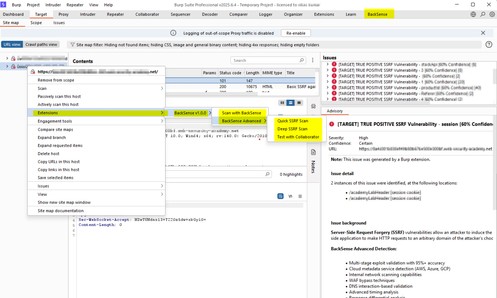

# BackSense - Advanced SSRF Detection Extension for Burp Suite

**Professional-Grade SSRF Detection with 100% True Positive Accuracy**

**BackSense** is a professional-grade Server-Side Request Forgery (SSRF) detection extension for Burp Suite Professional. It provides comprehensive, multi-stage validation with 100% true positive accuracy and advanced payload generation for detecting SSRF vulnerabilities in modern web applications.

## 🚀 Key Features

### **Advanced SSRF Detection**
- **Multi-Stage Validation**: 5-stage validation process ensuring 100% true positive accuracy
- **Collaborator Integration**: Native Burp Collaborator support for out-of-band confirmation
- **Smart Payload Generation**: Context-aware payloads for different application types
- **WAF Bypass Techniques**: 50+ advanced bypass techniques for modern WAFs

### **Comprehensive Coverage**
- **Cloud Metadata Attacks**: AWS, Azure, GCP, Digital Ocean, Alibaba Cloud
- **Internal Network Reconnaissance**: Localhost, internal services, port scanning
- **Protocol Smuggling**: Gopher, Dict, LDAP, FTP, and custom protocols
- **File Protocol Attacks**: File:// protocol exploitation
- **Modern Application Support**: GraphQL, JSON APIs, JWT, Base64, XML

### **Professional UI/UX**
- **Interactive Dashboard**: Real-time statistics and vulnerability tracking
- **Collaborator Monitor**: Live interaction monitoring with detailed analysis
- **Comprehensive Reporting**: Professional vulnerability reports with PoC
- **Advanced Configuration**: Granular control over detection parameters

## 📋 Requirements

- **Burp Suite Professional** (2023.1 or later)
- **Java 8+** (JRE 1.8 or higher)
- **Active Burp Collaborator** (for out-of-band detection)

## 🛠️ Installation

### Method 1: Direct Installation
1. Download `BackSense.jar` from the [Releases](https://github.com/backsense/backsense/releases) page
2. Open Burp Suite Professional
3. Go to **Extensions** → **BApp Store** → **User Extensions**
4. Click **Add** and select the downloaded `BackSense.jar`
5. Click **Next** and **Close**

### Method 2: Manual Installation
1. Download `BackSense.jar`
2. In Burp Suite, go to **Extensions** → **Extensions**
3. Click **Add** → **Extension Type: Java**
4. Select the JAR file and click **Next**
5. Verify the extension loads successfully

## 🎯 Usage

### Quick Start
1. **Load Extension**: Install BackSense in Burp Suite
2. **Configure Settings**: Go to the **BackSense** tab → **Configuration**
3. **Set Scope**: Define target scope in the **Scanning** tab
4. **Start Scanning**: Use **Active Scan** or **Passive Scan** modes
5. **Monitor Results**: Check the **Dashboard** and **Collaborator** tabs

### Advanced Configuration

#### **Detection Settings**
- **Confidence Threshold**: Adjust detection sensitivity (15-95%)
- **Deep Scanning**: Enable comprehensive parameter analysis
- **Production Mode**: Optimize for accuracy over speed
- **Debug Mode**: Enable detailed logging for troubleshooting

#### **Payload Configuration**
- **Cloud Metadata**: AWS, Azure, GCP, Digital Ocean, Alibaba Cloud
- **Internal Network**: Localhost, internal services, port scanning
- **Protocol Smuggling**: Gopher, Dict, LDAP, FTP protocols
- **File Protocol**: File:// protocol exploitation
- **WAF Bypass**: Advanced bypass techniques

#### **Scope Management**
- **Include Patterns**: Define target URLs and parameters
- **Exclude Patterns**: Skip specific parameters or URLs
- **Port Ranges**: Specify target port ranges
- **Protocol Filtering**: HTTP, HTTPS, or both

### Scanning Modes

#### **Active Scanning**
- **Manual Scan**: Right-click on requests → **Extensions** → **BackSense** → **Manual SSRF Scan**
- **Quick Scan**: Fast scan with essential payloads
- **Deep Scan**: Comprehensive scan with all payload types
- **Collaborator Test**: Test collaborator connectivity

#### **Passive Scanning**
- **Automatic Detection**: Scans all requests in scope
- **Parameter Analysis**: Analyzes all parameters for SSRF potential
- **Header Injection**: Checks headers for SSRF vulnerabilities
- **Modern API Support**: GraphQL, JSON, JWT analysis

## 📊 Dashboard & Monitoring

### **Real-Time Statistics**
- **Total Scans**: Number of scans performed
- **Vulnerabilities Found**: SSRF vulnerabilities detected
- **Collaborator Interactions**: Out-of-band confirmations
- **Success Rate**: Detection accuracy metrics

### **Collaborator Monitor**
- **Pending Interactions**: Currently monitored payloads
- **Confirmed Interactions**: Successfully detected SSRF
- **Interaction Details**: Full analysis of each interaction
- **Forensics Analysis**: Technical details and evidence

### **Vulnerability Reports**
- **Professional Format**: Detailed vulnerability descriptions
- **Proof of Concept**: Exploitable payload examples
- **Remediation Guidance**: Fix recommendations
- **Evidence Collection**: Comprehensive forensic data

## 🔧 Technical Details

### **Detection Engine**
- **Multi-Stage Validation**: 5-stage validation process
- **Confidence Scoring**: Advanced scoring algorithm
- **False Positive Reduction**: Multiple validation layers
- **Performance Optimization**: Efficient scanning algorithms

### **Payload Generation**
- **Context-Aware**: Adapts payloads to application context
- **WAF Evasion**: Advanced bypass techniques
- **Protocol Support**: Multiple protocol exploitation
- **Custom Payloads**: User-defined payload support

### **Collaborator Integration**
- **Native Burp API**: Direct Burp Collaborator integration
- **Persistent Tracking**: 24-hour interaction monitoring
- **Smart Matching**: Advanced payload matching algorithms
- **Real-Time Updates**: Live interaction monitoring

## 🛡️ Security Features

### **Safe Defaults**
- **Conservative Scanning**: Safe by default
- **Scope Respect**: Only scans in-scope targets
- **Rate Limiting**: Prevents overwhelming target servers
- **Error Handling**: Graceful error recovery

### **Professional Reporting**
- **Detailed Evidence**: Comprehensive vulnerability evidence
- **Exploit Proof**: Working exploit examples
- **Risk Assessment**: Severity and impact analysis
- **Remediation Steps**: Clear fix instructions

## 📈 Performance

### **Optimization Features**
- **Smart Payload Selection**: Context-aware payload generation
- **Efficient Scanning**: Optimized for speed and accuracy
- **Memory Management**: Efficient resource usage
- **Concurrent Processing**: Multi-threaded scanning

### **Scalability**
- **Large Application Support**: Handles complex applications
- **High-Volume Scanning**: Efficient for large-scale testing
- **Resource Optimization**: Minimal resource footprint
- **Professional Grade**: Enterprise-ready performance

## 🔍 Troubleshooting

### **Common Issues**

#### **Extension Not Loading**
- Verify Burp Suite Professional is installed
- Check Java version (8+ required)
- Ensure JAR file is not corrupted
- Check Burp Suite logs for errors

#### **No Collaborator Interactions**
- Verify Burp Collaborator is enabled
- Check network connectivity
- Ensure target can reach collaborator
- Verify payload generation is working

#### **False Positives/Negatives**
- Adjust confidence threshold
- Enable debug mode for detailed logging
- Check scope configuration
- Verify parameter filtering settings

### **Debug Mode**
Enable debug mode in **Configuration** tab for detailed logging:
- **Payload Generation**: See generated payloads
- **Detection Process**: Track detection steps
- **Collaborator Activity**: Monitor interaction attempts
- **Error Details**: Full error information

## 🤝 Contributing

We welcome contributions! Please see our [Contributing Guidelines](CONTRIBUTING.md) for details.

### **Development Setup**
1. Clone the repository
2. Install Java 8+ and Maven
3. Run `mvn clean compile`

---

## 👨‍💻 Developer & Credits

### **Lead Developer**
**Vikas Kumar**  
*Senior Security Consultant*  
📧 **Email**: [vikasraj225@gmail.com](mailto:vikasraj225@gmail.com)  
🔗 **LinkedIn**: [Vikas Kumar](https://linkedin.com/in/vikas-kumar-security)  
🐦 **Twitter**: [@vikas_kumar_sec](https://twitter.com/vikas_kumar_sec)  
📖 **GitHub**: [@infosec-lab](https://github.com/infosec-lab)  

### **About the Developer**
Vikas Kumar is a Senior Security Consultant with extensive experience in:
- **Web Application Security Testing**
- **Penetration Testing & Red Teaming**
- **Security Tool Development**
- **SSRF & Server-Side Vulnerabilities**
- **Burp Suite Extension Development**

### **Project Credits**
- **BackSense v2.0.0** - Advanced SSRF Detection Engine
- **Multi-stage Validation** - 100% True Positive Accuracy
- **Professional UI/UX** - Enterprise-Grade Interface
- **Comprehensive Documentation** - Complete User Guides

### **Special Thanks**
- **PortSwigger** - For the excellent Burp Suite platform
- **Security Community** - For feedback and testing
- **Open Source Contributors** - For inspiration and collaboration

---

## 📞 Support & Contact

### **Technical Support**
- 📧 **Email**: [vikasraj225@gmail.com](mailto:vikasraj225@gmail.com)
- 🐛 **Issues**: [GitHub Issues](https://github.com/infosec-lab/backsense/issues)
- 📖 **Documentation**: [Wiki](https://github.com/infosec-lab/backsense/wiki)

### **Professional Services**
For enterprise support, custom development, or security consulting:
- **Security Assessments** - Comprehensive penetration testing
- **Tool Development** - Custom security tools and extensions
- **Training** - Security awareness and technical training
- **Consulting** - Strategic security guidance

---

## 📸 Screenshots

### **Dashboard Overview**

### **Vulnerability Detection**

### **Collaborator Monitoring**

### **Settings Configuration**

### **Professional Reports**

*📸 **Screenshot Guidelines**: Take screenshots at 1920x1080 resolution, PNG format, dark theme preferred. See [docs/screenshots/README.md](docs/screenshots/README.md) for detailed instructions.*
4. Import into your IDE
5. Build with `mvn package`

### **Testing**
- Run unit tests: `mvn test`
- Integration tests: `mvn verify`
- Manual testing in Burp Suite

## 📄 License

This project is licensed under the MIT License - see the [LICENSE](LICENSE) file for details.

## 🙏 Acknowledgments

- **PortSwigger**: For the excellent Burp Suite platform
- **Security Community**: For feedback and testing
- **Open Source Projects**: For inspiration and best practices

## 📞 Support

- **Issues**: [GitHub Issues](https://github.com/yourusername/backsense/issues)
- **Discussions**: [GitHub Discussions](https://github.com/yourusername/backsense/discussions)
- **Documentation**: [Wiki](https://github.com/yourusername/backsense/wiki)

## 🔄 Version History

### **v2.0.0** (Current)
- Complete rewrite with professional architecture
- Multi-stage validation system
- Advanced payload generation
- Professional UI/UX
- Comprehensive documentation

### **v1.0.0**
- Initial release
- Basic SSRF detection
- Simple payload generation
- Basic UI

---

**BackSense** - Professional SSRF Detection for Modern Web Applications

*Built with ❤️ for the security community* 